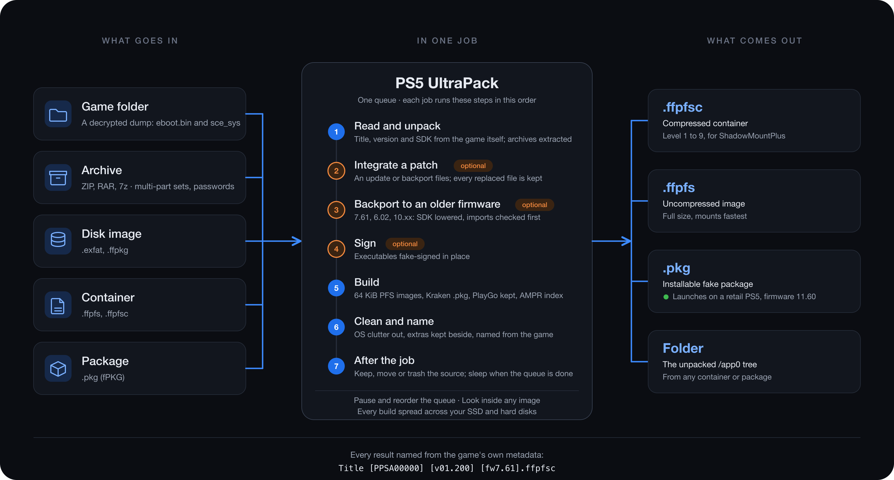

# PS5 UltraPack

<p align="center">
  
</p>

<p align="center">
  <b>Pack, convert, patch, backport and sign PS5 games, and build installable <code>.pkg</code> files. One Mac app, one queue.</b><br>
  Start from a game folder, an archive, a disk image, a <code>.ffpfs</code> or <code>.ffpfsc</code> container, or a <code>.pkg</code>. Say what to change and what should come out; the queue does the rest.<br>
  <sub>Formerly PS5 FFPFSC ULTRA.</sub>
</p>

<p align="center">
  
  
  
  
  
  
  
</p>

---

## Highlights

- **Installable `.pkg` on macOS.** No Wine, no Sony DLL. Homebrew and a retail title built here install and launch on a retail PS5 on firmware 11.60.
- **Backport to an older firmware.** The app lowers the SDK version of the game's executables and checks the game's imports against the target firmware's libraries before it builds. When the target lacks functions, it copies your patched system libraries into the game's `fakelib/` folder, prepared from BestPig's BackPork patches in one click. Targets: 7.61, 6.02, an SDK-only 10.xx, and any firmware whose libraries you keep in a folder.
- **Look inside without unpacking.** Browse a `.ffpfs`, `.ffpfsc` or `.pkg` and extract single files or folders. Only the blocks you ask for get decoded, byte-identical to the original.
- **Checked end to end.** The end-to-end test builds every conversion path from a real game and compares every file byte for byte, and a deterministic `.pkg` build of the same folder gives the same bytes, build after build.

## Screenshots

<p align="center">
  
</p>
<p align="center"><sub><b>Main window</b> &nbsp;·&nbsp; the queue with three jobs and the details of the running one</sub></p>

<table>
  <tr>
    <td align="center" width="50%"><br><sub><b>Queue</b> &nbsp;·&nbsp; every row shows its progress; a click on a job opens its details</sub></td>
    <td align="center" width="50%"><br><sub><b>Add job</b> &nbsp;·&nbsp; a source, what to change in it, what comes out</sub></td>
  </tr>
  <tr>
    <td align="center" width="50%"><br><sub><b>Look inside</b> &nbsp;·&nbsp; the tree of a .ffpfs, .ffpfsc or .pkg; single files out, nothing else unpacked</sub></td>
    <td align="center" width="50%"><br><sub><b>Light mode</b> &nbsp;·&nbsp; View › Appearance</sub></td>
  </tr>
</table>

Earlier interfaces are kept for comparison in [docs/screenshots](docs/screenshots/README.md).

## 🎮 PS5 fPKG that launches on 11.60

**Build console-installable PS5 `.pkg` files on macOS, in-process: no Wine, no Sony DLL.** The bundled `ffpfsc-pkg-tool` (a self-contained .NET 9 build of drakmor's LibProsperoPkg 1.2.0, GPL-3) turns any source, a game folder, an archive, a `.ffpfsc` or an `.exfat` image, into a debug `.pkg` that installs and launches on a jailbroken PS5.

<p align="center">
  
</p>

**Verified 2026-09-24 on a retail PS5, firmware 11.60, kstuff-lite 1.13-dr-test3:** the `HomebrewTest` fPKG built by this tool launches, with no `CE-100096-6` and no corrupted-data error. A byte diff against a `libScePubTools.dll` reference build shows an identical inner PFS; only the outer PFS wrap differs, in timestamp and ICV bytes the loader does not check. The "11.40 at most" ceiling of earlier builds came from one wrong outer-PFS wrap mode in this builder, not from a Sony patch.

**Retail titles launch too (since 1.1.12, verified 2026-09-25 and again 2026-10-05 with the current library, on the same console):** a game built from its own container installs, starts and keeps its saves. The builder validates the source's PlayGo files, stamps the retail DRM type and license entries, and keeps the backport emulators in `fakelib/`.

- **Any source** becomes a `.pkg`: a game folder, a parent folder (one package per game), an archive, a disk image (`.exfat` / `.ffpkg`), or an existing `.ffpfs` / `.ffpfsc` (unwrapped on the temp drive first).
- **The identity comes from the game.** Content ID, title ID, version and title are read from the source's own `sce_sys/param.json` when the package is built. **More options** holds them as fallbacks, and asks for them when a game folder has no `param.json`.
- **A validate checklist runs after every build:** container, metadata signature, PlayGo set, presentation images and their DDS, license, NP files, sound, the identity in `param.json`, titles, versions, firmware and the eboot. If the console rejects a package, the log names the check that failed.
- **Damaged sources are repaired in the staging copy, never in place.** A presentation image in the wrong form is converted (icon0 to 512×512 RGB, pic2 RGBA), one that is no image at all is rebuilt from its DDS, a stale DDS is regenerated, and a PlayGo set that does not describe the packed files is rebuilt. A `param.json` that is not JSON, or an empty `eboot.bin`, stops the build with a clear message.
- **Auto-organize** names the result `<Title> [TITLEID] [vXX.YYY] [fwN.NN].pkg` in a folder per title, from `param.json` and the firmware the game needs.
- **The other direction is the same editor:** a `.pkg` with **Folder** as the output extracts the whole `/app0` tree (the inner PFS plus the `sce_sys` metadata the package keeps outside it), ready to pack, patch or turn back into a `.pkg`. Package, folder, package is a fixed point: a deterministic build of the extracted folder gives the same bytes.

How far packages run depends on the jailbreak on the console, not on this builder. The format has not changed; as `kstuff` reaches newer firmware, packages built here are expected to run there too.

## Backport: run a game on an older firmware

<table>
  <tr>
    <td align="center" width="50%"><br><sub><b>In Add job</b> &nbsp;·&nbsp; target firmware and Check</sub></td>
    <td align="center" width="50%"><br><sub><b>Settings › Backport & libraries</b> &nbsp;·&nbsp; your firmware folder, patched libraries, Prepare in one click</sub></td>
  </tr>
</table>

A backport lowers the SDK version a game declares in `eboot.bin` and every `prx`/`sprx`, and ships the newer system libraries the old firmware lacks in the game's `fakelib/` folder, where ShadowMountPlus mounts them over the system's own. The app does the first part and copies the second from a folder you own. **No system library is bundled with or linked from this app**; you extract them from your own firmware and apply the public patches yourself, or let **Prepare** apply them for you.

The executables can be plain or fake-signed. In a signed file the app changes the two SDK values inside the signature container and keeps every other byte. Encrypted executables, a retail dump nobody decrypted, stop the job with a message: nothing in them can be read or changed.

| Target | SDK values | Status |
|---|---|---|
| **7.61** | public table | Public library patches exist for this target; the documented community path. |
| **6.02** | public table | Experimental: a smaller public library set; only some titles run. |
| **10.xx** | public table | SDK only: for a game newer than the console. |
| **Any firmware in your folder** | read from that firmware's own libraries | The values that firmware's own system libraries carry; Check shows whether the game also needs patched libraries. |

The public table stops at 10.xx, and the app does not invent values beyond it. Whether a backported title runs depends on the title and on the fakelib support of the jailbreak.

**Your firmware folder.** In Settings › Backport & libraries, point the app at a folder with one subfolder per firmware, named by its version (`7.61`, `9.60`, `10.01`, …), each holding that firmware's original libraries. Every subfolder becomes a target in Add job, with the SDK values its own libraries carry. The app refuses a subfolder whose libraries are encrypted or come from a newer firmware than its name.

**Check, and when you need patched libraries.** With the firmware folder set, **Check** in Add job reads every function the game imports and looks for it in the target firmware's libraries, your patched libraries and the game's own modules. It reads a game folder, or only the executables out of a `.pkg`, `.ffpfs` or `.ffpfsc`. If the target has them all, lowering the SDK is enough. If it lacks some, the game needs patched libraries for that target, and public ones exist only for 7.61 and 6.02. Every build runs the same check first, on a container before it unpacks the game; when libraries are missing and none are set, it stops before it changes anything and names them.

```bash
python3 backend/cli.py --backport-analyze <game folder> --backport-target 9.60 --fw-libs-root <firmware folder>
```

**One-click prepare.** Put your 10.01 libraries in the `10.01` subfolder, pick a folder for the patched result, then click **Prepare 7.61** or **Prepare 6.02**. The app downloads the current BPS patches from [BestPig/BackPork](https://github.com/BestPig/BackPork), applies each one to the matching 10.01 library and writes the patched files into `<patched folder>/<target>/`. A job copies the set for its target into `fakelib/`. The download is small and cached; nothing Sony-copyrighted leaves your machine.

```bash
python3 backend/cli.py --prepare-backport-libs 7.61 --fw-libs-root <firmware folder> --backport-libs <patched folder>
```

Any build takes `--backport-target`, and the chain mode does the whole thing on a container in one call:

```bash
python3 backend/cli.py <game>.ffpfsc <output folder> --to ffpfsc --backport-target 7.61 --fw-libs-root <firmware folder> --backport-libs <patched folder>
```

## One job, from source to finished file

One button, **Add job** (⌘N), or drop a file or folder anywhere in the window. Every job the app can run is the same three things, and the editor asks for exactly those:

1. **Source**: a game folder, a parent folder of games (one job each), an archive (`.zip` / `.rar` / `.7z`), a disk image (`.exfat` / `.ffpkg`), a `.ffpfs`, a `.ffpfsc` or a `.pkg`. One line says what was detected: kind, title ID, version, SDK version. For an image or a package, **Look inside…** opens the browser.
2. **Change the content**, optional, applied in this order: **integrate a patch** (folder or archive), **backport** to an older firmware, **sign** the executables (fake-sign). Each shows its options only when checked.
3. **Output**: **Folder**, **`.ffpfs`**, **`.ffpfsc`** or **`.pkg`**, for any source. A compressed format shows its compression in one row: a level from 1 to 9 for `.ffpfsc`, normal or fast for `.pkg`. `.pkg` also shows its retail switches, and the identity and codec under **More options**.

A sentence above the button says what the queue will do (*Backport to 7.61, then build .pkg*, *Unpack to folder*, *Build .pkg*, *Sign in place*) and the queue row carries the same sentence. The same format with nothing to change is a copy or move; a folder to a folder with nothing to change is refused. The editor remembers your choices per kind of source, so the next drop is source, then Enter.

Each job carries its own source, output folder, format and compression; Settings › Compression holds the values a new job starts with. Double-click a job, or use **Edit**, to change it; every kind of job opens in the same editor and keeps its place in the queue. Jobs stay in the order you added them and run from the top down; drag one to another place, or right-click › **Run next**, to change what runs when. ⌘-click and Shift-click select several jobs, and **Remove** takes them all out of the queue. The last source is pre-selected the next time Add job opens, and **Rescan** finds new downloads in that folder and queues them with the same settings. While the queue runs, the foot of the list shows the progress over all its jobs and about how long they still take. Each job is named after its game and title id as soon as its param.json can be read, from an archive too when it is not solid. When a job is due, it checks whether its output is already in the output folder (before an archive is unpacked when the game can be read). If it is, and the job moves, trashes or deletes its source, it does that and counts as Done; a job that keeps its source is skipped. Settings can make that Ask, Overwrite or Keep both. A finished job stays in the queue, marked Done, until you clear it with **Clear completed** (right-click it for Clear failed and Clear all); Settings can remove finished jobs right away instead. A failed job stays in the queue, marked as such, while the rest of the batch keeps running, and keeps what it extracted from its archive until you remove it. **Edit** changes it, **Retry** runs it again on its own. **Pause** lets the running job finish and stops the queue before the next one (click it again to take that back); **Stop** cancels the running job and ends the batch. Either way, a later **Start** runs what is left.

The window is a sidebar, the queue and a details pane. The queue takes the full width until you click a job; then the details open with its recipe, its target folder and, while it runs, its stages, speed, elapsed and remaining time and the last log lines. The button at the right of the queue header, or ⌥⌘I, closes them again. The sidebar switches between **Queue**, **History** (past jobs and totals) and **Log** (everything the backend printed), and holds **Look inside**, **Organize** and **Clean temp**. Settings is a view of the window too; Add job, Edit job and Look inside open as pages over the content. Messages, such as a job's result, an error report or a password prompt, come up in a small window of their own. The menu bar has the same commands with their shortcuts: ⌘ on macOS, Ctrl on other systems.

## What it packs

- A decrypted PS5 game folder (`eboot.bin` plus `sce_sys/param.json`).
- A disk image: `.exfat` or `.ffpkg`.
- An existing `.ffpfs`, re-wrapped into its compressed `.ffpfsc`.
- An archive: ZIP, RAR or 7z. The app extracts it, finds the game inside and packs that. Multi-part RAR sets collapse to one job. A 7z extracts through the native `7z` / `7zz` CLI when present (3 to 10 times faster) and falls back to pure-Python `py7zr` otherwise.
- A finished PS5 fake package (`.pkg`): choose **Folder** as the output and the app extracts the whole `/app0` tree (the inner PFS plus `sce_sys/param.json`, `icon0.png` and the PlayGo files from the CNT container) into a folder you can pack, patch or turn back into a `.pkg`.

Saved archive passwords are tried automatically. When none unlocks an archive's header, the app asks once when you add the job and remembers the answer, which also lets the router size the job correctly up front.

## What it produces

- **`.ffpfsc`**, the compressed container, or **`.ffpfs`**, the uncompressed image (faster to mount, full size). Chosen per job.
- **`.pkg`**, an installable PS5 debug fake package, from any source; see the fPKG section above. The tool generates `sce_sys/icon0.dds` with Magick.NET, which the console needs to launch.
- **Auto-organize** (on by default) names the result from the game's own `param.json`, whatever the source was called: `<Output>/<Title> [TITLEID] [vXX.YYY.ZZZ]/<Title> [TITLEID] [vXX.YYY] [fwN.NN].ffpfsc` (or `.pkg`), with the extras that came with the game copied into that folder. `[fwN.NN]` is the firmware the game needs, read from the SDK version in `eboot.bin` (for a container through its headers only); a backport lowers it to the target, an integrated patch counts with its own `eboot.bin`, and an unreadable one leaves the tag out. An archive inside a folder named `convert` still ends up as `Example Quest Deluxe Edition [PPSA00001] [v01.200.007]/Example Quest [PPSA00001] [v01.200] [fw8.00].ffpfsc`: a name that would break ShadowMountPlus's byte limit is shortened on a byte budget, dropping edition words ("Deluxe Edition", "Remastered") before truncating.

## Why this one

A plain packer asks you to prepare a clean folder, then writes a single image to one drive and hopes it fits. This one does that thinking for you.

- **It routes the build across your drives.** It reads the source off one drive, builds the inner image on your fast temp SSD, and streams the final container to the output drive, so no disk reads and writes the same data during compression. When the whole footprint fits the SSD it keeps everything there; when it does not, it splits the work; when the SSD cannot even hold the image, it falls back to the output drive so the build still finishes. Every choice is printed in the log.
- **It tells your drives apart, the awkward ones too.** It detects SSD versus HDD per volume and never treats a big slow disk as scratch just because it has the most free space. A USB SSD that reports no flash flag (common behind a bridge) gets a short timed write, so it is recognized as the SSD it is. A free-space gate skips a job with real numbers instead of failing mid-build.
- **It builds images the console reads.** Packing forces the 64 KiB PFS block size the PS5 expects. A smaller block passes a local build and verify, then the console misreads the filesystem and crashes on launch. Boot-tested on firmware 11.60: 64 KiB boots, a 4 KiB build of the same game crashes.
- **You feed it the download, not a prepared folder.** It reads ZIP, RAR and 7z straight through, including multi-part RAR sets and archives with encrypted headers. macOS carries a self-contained native UnRAR module, so RAR needs nothing external.
- **It keeps the image clean without losing your files.** Extras that ship next to a game, such as text files, checksum files or a bundle folder, never enter the image, and none of them is deleted: the app moves them next to the finished container. OS clutter (`.DS_Store`, `._*`, `__MACOSX`) is dropped everywhere: it is not unpacked, not copied, not packed and not moved along.
- **It changes what you ask for, in one run.** Patch, backport and sign are steps of the same job, applied in a fixed order on a staging copy, and the result is validated before it counts as done.
- **It opens a packed image and pulls one file out.** **Look inside** decompresses only the blocks it touches, so opening a 100 GB container does not wait for a full decompression, and one file costs a fraction of a full unpack.

## Look inside an image

**Look inside** (in the sidebar, the link under the source in Add job, or a double-click on the file in Finder) opens a `.ffpfs`, a `.ffpfsc`, or a `.pkg` (fPKG) and shows its contents as a tree, with multi-select and a live name filter. Pick a file, a folder, or several at once, and extract just those to a folder you choose. The rest of the image stays packed — a `.pkg` is decrypted and decoded block by block (a 240 MB package lists in about a tenth of a second reading 1.5 MiB), and the `sce_sys` metadata the package keeps outside its inner image (`param.json`, icons, PlayGo files) shows up in the tree like any other file.

It reads only the blocks it touches: listing the tree decompresses just the filesystem metadata, and extracting a file decompresses only that file's blocks. Neither costs a full unpack, even on a compressed `.ffpfsc` (which it reads by descending into the inner image and decoding blocks on demand). What comes out is byte-for-byte identical to the original, audited and sha256-verified against mkpfs's own extractor in both formats. The view is read-only and never changes the image.

## How it places work across drives

In Auto mode the router decides where each part of a build lives, then states its decision in the log:

- Source, inner image, and spool on one SSD when the whole footprint fits.
- Otherwise a split: the inner image on the SSD, the extracted source on the output drive, with the pass-2 spool routed wherever it fits.
- The output drive alone when nothing fits the SSD, so the build still completes.

It detects SSD versus HDD per drive, including USB SSDs that report no flash flag (it times a short write to tell them apart). A configurable temp folder and an optional extra scratch pool feed the router, and a free-space gate skips a job with real numbers rather than failing mid-build. You can force same-drive read-and-write on (for an SSD) or off in Settings.

## What it keeps out of the image, and what it keeps for you

- OS clutter never travels: `.DS_Store`, AppleDouble `._*` sidecars, `__MACOSX`, `Thumbs.db`, `desktop.ini`. Archives are unpacked without it, a folder is cleaned before an image or a package is built from it, an image or package unpacked to a folder comes out without it, and a finished job's move to another folder leaves it behind.
- Extras that ship next to a game never enter the image either, but the app keeps them: a bundle folder and loose text, checksum and parity files move out of the source and land next to the finished container.

## Special titles

- **PlayGo / APR titles**: the app detects `playgo-chunk.dat`, injects the fakelib `.sprx` and an `AMPRIDX3` index, and signs before indexing so the index records the right sizes.
- **HDR**: whether a game supports HDR is declared by its publisher in `sce_sys/param.json` (`attribute` bit 29); the console switches the TV to HDR only for titles that set it. fPKG builds keep that declaration by default (`--fpkg-hdr-flag auto|on|off`). To see it for a whole library: `python3 backend/cli.py --param-report <folder>` lists every folder, `.ffpfsc`, `.ffpfs` and `.pkg` with its title id, version, HDR flag, required system software and SDK version, reading only the one file per game.
- **Fake-sign**: a vendored, pure-Python `make_fself` (no keys, no native dependency) re-signs `eboot.bin`, `.elf`, `.prx`, and `.sprx` in place. Already-signed files are skipped, so a repeat run is safe.

## Requirements

- macOS on Apple Silicon. Builds and releases exist for nothing else; the Python sources are portable in principle but untested on other systems.
- Python 3.10 or newer, to run from source or to build.
- A C++ compiler for the bundled UnRAR module (Xcode Command Line Tools), needed only when building.
- Optional but recommended for fast 7z: a native 7-Zip CLI on `PATH` (`brew install sevenzip`, or `p7zip`). Without it, `.7z` extraction falls back to the slower pure-Python path.

## Run from source

```bash
python3 -m pip install customtkinter pillow tkinterdnd2 py7zr rarfile psutil cryptography
python3 -m pip install ./backend/unrar
python3 PS5_UltraPack.py
```

## Build a standalone app

Run the build script from the repository root inside an activated virtual environment (it refuses to run outside one and installs the pinned inputs from `requirements-build.txt`). It needs the [.NET SDK](https://dotnet.microsoft.com/download) 9 or newer: the fPKG helper is not tracked in git, the script builds it from `backend/native/src/ffpfsc-pkg-tool` with `./BUILD_PKG_TOOL.sh` first. Run that script on its own to use `.pkg` features or the tests from a source checkout. The build produces `dist/PS5 UltraPack.app`, the release archive `dist/PS5-UltraPack-<version>-macos-arm64.zip` and its `.sha256`:

```bash
python3 -m venv .venv && source .venv/bin/activate
./BUILD_MACOS_APP.sh
```

The app is ad-hoc signed. On a Mac other than the one it was built on, clear the quarantine flag before the first launch:

```bash
xattr -dr com.apple.quarantine "PS5 UltraPack.app"
```

## Sources and credits

This is not a fork. It bundles and builds on the work below, with thanks to the authors:

- [ps5-ffpfs-cli](https://github.com/bizkut/ps5-ffpfs-cli) by Bizkut, the backend wrapper that `backend/cli.py` grew out of (no license file upstream; see `NOTICES.md`).
- [MkPFS](https://github.com/PSBrew/MkPFS) by PSBrew, the PFS image builder used for packing and compression (bundled, 1.0.0).
- [LibProsperoPkg](https://github.com/drakmor/LibProsperoPkg) 1.2.0 (build `d7090eb6`) by drakmor, the PS5 `.pkg` build/extract library the bundled `ffpfsc-pkg-tool` wraps (GPL-3, assembly taken from the fpkg-gui 0.6.11 release). Wrapper source under `backend/native/src/ffpfsc-pkg-tool/`.
- `make_fself` from the ps5-payload-dev / flatz lineage, vendored for fake-signing (BSD-3).
- UnRAR by RARLAB ([rarlab.com](https://www.rarlab.com/)), vendored as C++ source for the built-in RAR module under the UnRAR license (free for extraction; it may not be used to build a RAR-compatible compressor).
- ShadowMountPlus and MicroMount, the loaders the `.ffpfsc` containers target.
- kstuff-lite by EchoStretch and the fpkg-launch fixes by Drakmor + ArkSama (2026-09), the console-side pieces without which fPKG on 11.60 wouldn't launch at all.

Python libraries used: customtkinter, py7zr, rarfile, tkinterdnd2, Pillow, psutil, cryptography.

## License

Full breakdown — including trademark and user-responsibility notes — is in [`NOTICES.md`](NOTICES.md). In short:

- **Source code authored here** (the Python GUI, the Python wrappers around the bundled tools, the C# wrapper around LibProsperoPkg, the tests and build inputs; for `backend/cli.py` this project's own contributions, see below) — **MIT** (see [`LICENSE`](LICENSE)).
- **Bundled MkPFS 1.0.0** by PSBrew — **GPL-3.0-or-later** ([`backend/mkpfs/LICENSE`](backend/mkpfs/LICENSE)).
- **Bundled LibProsperoPkg 1.2.0** by SvenGDK/drakmor — **GPL-3.0-or-later** ([`backend/native/LICENSE.LibProsperoPkg`](backend/native/LICENSE.LibProsperoPkg)).
- **Bundled UnRAR sources** by RARLAB — **UnRAR license**; free for extraction, but **may not** be used to build a RAR-compatible compressor ([`backend/unrar/license.txt`](backend/unrar/license.txt)).
- **Vendored `make_fself.py`** (Alex Free / flatz / ps5-payload-dev lineage) — **BSD-3-Clause**; attribution in the file header.
- **Bizkut's `ps5-ffpfs-cli`** — no license file upstream. `backend/cli.py` started as that tool's backend wrapper and has been rewritten extensively here; `backend/unrar/rarfile.py` mirrors a subset of the `rarfile` API it used. No license is claimed for what remains of the upstream code; MIT applies to this project's own contributions. Detail in `NOTICES.md`.

**The compiled `.app` binary** statically embeds MkPFS and LibProsperoPkg and is therefore distributed as a **combined work under GPL-3.0-or-later** (GPL-3 section 5). Everything needed to rebuild it is in this repository — the Python and C# sources, the pinned NuGet references, and the LibProsperoPkg 1.2.0 assembly (pristine and patched, with the patch tooling and a modification notice under `backend/native/src/ffpfsc-pkg-tool/lib/`); LibProsperoPkg's lineage is upstream at [drakmor/LibProsperoPkg](https://github.com/drakmor/LibProsperoPkg), and `lib/README.md` records which build is bundled and where its source stands. Every bundled component's license is GPL-3 compatible.

**Not affiliated with Sony Interactive Entertainment Inc.** "PlayStation" and "PS5" are trademarks of Sony Interactive Entertainment; use here is nominative fair use to identify the format and console this tool interoperates with. This tool builds and processes PS5 package formats from files **you** supply — it does not decrypt, decode, or distribute any Sony-owned content, firmware, keys, or executables. You are responsible for having the legal right to any content you process with it (dumps of games you own, homebrew you have written or been licensed to redistribute). See `NOTICES.md` for the full statement.
